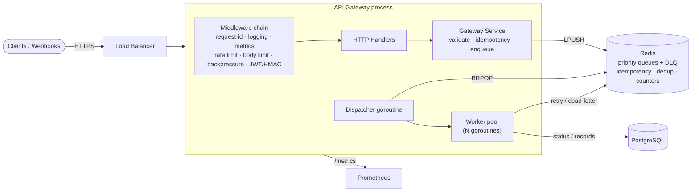
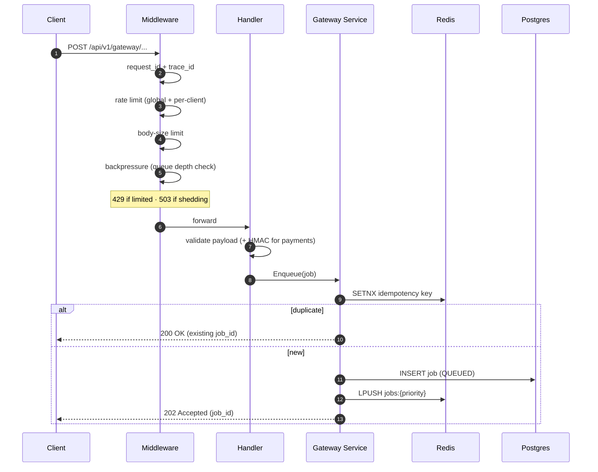
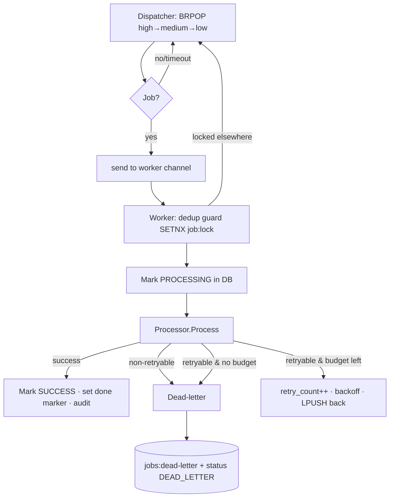

# Ingress API Gateway

A high-throughput, concurrency-first **API gateway for an event-management platform**, written in Go. It accepts spiky, latency-sensitive traffic (registrations, payment webhooks, QR scans, notifications), validates and protects itself at the edge, and hands work to a pool of background workers that drain a **Redis priority queue** concurrently. It is built to demonstrate the patterns that make Go a strong fit for backend systems at scale: goroutines, channels, worker pools, rate limiting, backpressure/load shedding, retries with backoff, dead-letter queues, idempotency, graceful shutdown and first-class observability.

> Module path: `github.com/viveksoni003/ingress-api-gateway`

---

## Table of contents

- [Overview](#overview)
- [Why Go](#why-go)
- [Architecture](#architecture)
- [Request lifecycle](#request-lifecycle)
- [Worker lifecycle](#worker-lifecycle)
- [Queue design](#queue-design)
- [Rate limiting](#rate-limiting)
- [Backpressure & load shedding](#backpressure--load-shedding)
- [Idempotency](#idempotency)
- [API reference & curl examples](#api-reference--curl-examples)
- [Run locally](#run-locally)
- [Run the tests](#run-the-tests)
- [Run the load test](#run-the-load-test)
- [Metrics](#metrics)
- [Project layout](#project-layout)
- [AWS deployment](#aws-deployment)
- [Resume bullets](#resume-bullets)

---

## Overview

The gateway never processes heavy work synchronously on the request path. Instead it does the cheap, fast things up front — authentication, validation, signature verification, rate limiting, idempotency and a backpressure check — then **enqueues a job and returns `202 Accepted`**. A configurable pool of worker goroutines consumes jobs from Redis in priority order and performs the real work (writing to PostgreSQL, updating counters, fanning out notifications), with retries, exponential backoff and a dead-letter queue for poison messages.

Four traffic types are supported, each mapped to a processing priority:

| Traffic type      | Endpoint                              | Priority | Why |
|-------------------|---------------------------------------|----------|-----|
| Payment webhook   | `POST /api/v1/gateway/payment-webhooks` | HIGH   | Money; must not be dropped or delayed |
| QR scan           | `POST /api/v1/gateway/qr-scans`         | HIGH   | Live gate/attendance, latency sensitive |
| Registration      | `POST /api/v1/gateway/registrations`    | MEDIUM | Important but tolerant of small delays |
| Notification      | `POST /api/v1/gateway/notifications`    | LOW    | Best-effort, retriable |

---

## Why Go

- **Cheap concurrency.** Goroutines are a few KB each, so a worker pool of hundreds is trivial. The gateway uses one dispatcher goroutine plus N worker goroutines coordinated over a buffered channel.
- **Channels for coordination.** The dispatcher fans work out over a channel; graceful shutdown is "cancel one context, close one channel, wait on a `sync.WaitGroup`."
- **`context.Context` everywhere.** Cancellation and deadlines propagate through Redis/PostgreSQL calls and the worker loop, which makes graceful shutdown and per-request timeouts clean.
- **Static binary + fast startup.** A single ~15 MB static binary in a distroless image starts in milliseconds — ideal for autoscaling on ECS/Fargate or Kubernetes.
- **Predictable performance.** No GC pauses of the kind that hurt p99 in heavier runtimes; the gateway happily pushes tens of thousands of requests/second on a laptop.

---

## Architecture



The codebase follows **clean / hexagonal architecture**: the `internal/domain` package holds entities and **port interfaces** (`Queue`, `Cache`, `RateLimiter`, repositories, `Processor`, `Enqueuer`) and imports nothing internal. Every other package (Redis queue, Redis cache, Postgres store, HTTP, workers) is an adapter that depends inward on those ports, so components are swappable and unit-testable.

---

## Request lifecycle



Every log line on this path carries `request_id`, `trace_id`, `method`, `path`, `status` and `latency`, so a request can be followed end-to-end and correlated with the worker logs that later process its job.

---

## Worker lifecycle



- **Topology:** a single dispatcher does the blocking `BRPOP` and feeds a buffered channel; `WORKER_COUNT` worker goroutines read from it. This is the idiomatic Go worker pool and keeps shutdown simple.
- **Retries:** transient failures are retried with **full-jitter exponential backoff** (`RETRY_BASE_DELAY * 2^(n-1)`, capped at `RETRY_MAX_DELAY`). A job that returns a `ErrNonRetryable`-wrapped error (e.g. malformed payload) skips retries.
- **Dead-letter queue:** once `retry_count` hits `max_retries`, the job is moved to `jobs:dead-letter` and marked `DEAD_LETTER` in Postgres; admins can inspect and re-queue it.
- **Duplicate-processing guard:** a Redis `SETNX job:lock:<id>` (plus a `job:done:<id>` marker) ensures a job is processed once even if it appears twice on the queue.

---

## Queue design

Redis lists are used as FIFO queues — producers `LPUSH`, the dispatcher `BRPOP`s. Passing the three priority keys to a single `BRPOP` yields priority ordering for free (it returns from the first non-empty key):

```
jobs:high      ← payment webhooks, QR scans
jobs:medium    ← registrations
jobs:low       ← notifications
jobs:dead-letter
```

Redis is also used for: idempotency keys (`idemp:<type>:<key>`), QR de-duplication (`qr:seen:<event>:<code>`), live attendance counters (`attendance:<event>`), and the worker dedup lock/done markers. Lists are simple, fast and battle-tested; the `Queue` port abstracts them, so a move to Redis Streams (consumer groups, acks) or SQS is a single adapter swap.

---

## Rate limiting

A hand-rolled **token-bucket** limiter (`internal/ratelimiter`) is applied at two scopes:

- **Global** — one shared bucket protects the whole process from aggregate overload (`GLOBAL_RATE_RPS`, `GLOBAL_RATE_BURST`).
- **Per-client (route-level)** — one bucket per client IP so a noisy client can't starve others (`ROUTE_RATE_RPS`, `ROUTE_RATE_BURST`); idle buckets are evicted by a janitor goroutine.

Each bucket refills continuously at `rps` tokens/second up to `burst`. When a bucket is empty the request is rejected with **`429 Too Many Requests`** and a `Retry-After` header, and `gateway_rate_limited_total{scope=...}` is incremented. (In a multi-instance deployment you'd back this with Redis `INCR`+TTL; see the AWS notes.)

---

## Backpressure & load shedding

Before accepting a job, the gateway checks the **total Redis queue depth**. If it is at or above `QUEUE_MAX_DEPTH`, the request is shed with **`503 Service Unavailable`** + `Retry-After`, and `gateway_load_shed_total` is incremented. This protects workers and PostgreSQL from being buried during a spike: the gateway degrades gracefully instead of collapsing, and clients back off and retry. The check **fails open** — if Redis is briefly unreachable for the depth probe, traffic is allowed rather than blanket-rejected.

---

## Idempotency

Webhooks and client retries cause duplicates. Each accepted request computes an idempotency key:

1. Use the `Idempotency-Key` header if supplied; otherwise derive one from `SHA-256(job_type + body)`.
2. `SETNX idemp:<type>:<key> = job_id` with TTL `IDEMPOTENCY_TTL`.
3. If the key was **new**, create + enqueue the job and return `202` with the new `job_id`.
4. If it **already existed**, return `200` with the **original** `job_id` and `"duplicate": true` — no second job is created.

At the storage layer, payment events also upsert on `gateway_order_id`, and QR scans are de-duplicated within `QR_DEDUP_TTL`, giving defense-in-depth idempotency.

---

## API reference & curl examples

Public endpoints return `202 Accepted` (or `200` for an idempotent replay). Admin endpoints require a `Bearer` JWT with `role=admin`.

```bash
# 1) Registration
curl -i -X POST localhost:8080/api/v1/gateway/registrations \
  -H 'Content-Type: application/json' \
  -H 'Idempotency-Key: reg-abc-123' \
  -d '{"event_id":"evt-1","attendee_name":"Vivek","email":"vivek@example.com","ticket_type":"VIP"}'

# 2) QR scan
curl -i -X POST localhost:8080/api/v1/gateway/qr-scans \
  -H 'Content-Type: application/json' \
  -d '{"qr_code":"QR-001","event_id":"evt-1","gate_id":"G1","scanned_by":"scanner-1"}'

# 3) Notification
curl -i -X POST localhost:8080/api/v1/gateway/notifications \
  -H 'Content-Type: application/json' \
  -d '{"channel":"EMAIL","recipient":"vivek@example.com","template":"promo","subject":"Hi","body":"Hello"}'

# 4) Payment webhook (HMAC-SHA256 signed over the raw body)
BODY='{"gateway_order_id":"order_777","payment_id":"pay_1","payment_status":"CAPTURED","amount_cents":50000,"currency":"INR"}'
SECRET='whsec_dev_secret_change_me'
SIG=$(printf '%s' "$BODY" | openssl dgst -sha256 -hmac "$SECRET" | sed 's/^.* //')
curl -i -X POST localhost:8080/api/v1/gateway/payment-webhooks \
  -H 'Content-Type: application/json' -H "X-Signature: $SIG" -d "$BODY"

# --- Admin (JWT) ---
TOKEN=$(make -s admin-token)          # or: go run ./cmd/admin-token
curl -s localhost:8080/api/v1/admin/jobs/stats        -H "Authorization: Bearer $TOKEN" | jq
curl -s "localhost:8080/api/v1/admin/jobs?status=SUCCESS&limit=20" -H "Authorization: Bearer $TOKEN" | jq
curl -s localhost:8080/api/v1/admin/jobs/<JOB_ID>     -H "Authorization: Bearer $TOKEN" | jq
curl -s -X POST localhost:8080/api/v1/admin/jobs/<JOB_ID>/retry -H "Authorization: Bearer $TOKEN" | jq
curl -s localhost:8080/api/v1/admin/dead-letter-jobs  -H "Authorization: Bearer $TOKEN" | jq

# --- Health / docs / metrics ---
curl -s localhost:8080/health ; curl -s localhost:8080/ready
open  localhost:8080/docs       # Swagger UI (served from docs/openapi.yaml)
curl -s localhost:8080/metrics  # Prometheus exposition
```

---

## Run locally

### Option A — Docker Compose (everything)

```bash
make up        # builds the image, starts gateway + redis + postgres + prometheus
make logs      # tail gateway logs
# gateway:    http://localhost:8080
# swagger:    http://localhost:8080/docs
# prometheus: http://localhost:9090
make down
```

Migrations are auto-applied to a fresh Postgres on first boot (mounted into `docker-entrypoint-initdb.d`).

### Option B — Run the binary, deps in Docker

```bash
go mod tidy                              # first time: resolves deps, writes go.sum
docker compose up -d redis postgres
psql "$DATABASE_URL" -f migrations/0001_init.up.sql   # or: make migrate-up
cp .env.example .env
make run                                 # go run ./cmd/gateway
```

> **First build note:** this repo ships `go.mod` without a committed `go.sum`. Run `make tidy` (`go mod tidy`) once to download dependencies and generate `go.sum`. The Dockerfile does this automatically.

---

## Run the tests

```bash
make test            # all tests, race detector on (uses miniredis + in-memory store — no Docker needed)
make cover           # HTML coverage report
```

Covered behaviours include: token-bucket rate limiting, idempotent enqueue (explicit + derived keys), queue push/pop priority ordering, worker retry-then-success, dead-letter movement after max retries, graceful shutdown draining in-flight work, HMAC signature verification, JWT generation/verification, QR duplicate-scan prevention, and a full HTTP→queue→worker→store integration test in `tests/`.

---

## Run the load test

With the gateway running:

```bash
go run ./cmd/loadtester -url http://localhost:8080 -c 100
# defaults: 10k registrations, 10k QR scans, 5k payment webhooks, 20k notifications
```

Sample report:

```
================ Load Test Report ================
Total requests : 45000
Success (2xx)  : 45000
Failed         : 0
Duration       : 6.21s
Throughput     : 7251 req/s
Avg latency    : 12.9ms
p50 latency    : 9.8ms
p95 latency    : 31.4ms
p99 latency    : 58.7ms
==================================================
```

(Numbers depend on your hardware; the point is the gateway accepts and queues tens of thousands of requests while workers drain them asynchronously.)

---

## Metrics

Prometheus metrics are exposed at `/metrics`:

| Metric | Type | Meaning |
|---|---|---|
| `gateway_http_requests_total{method,route,status}` | counter | Request count by route + status |
| `gateway_http_request_duration_seconds{method,route}` | histogram | Request latency |
| `gateway_queue_depth{priority}` | gauge | Live depth of each priority queue |
| `gateway_dead_letter_depth` | gauge | Dead-letter queue depth |
| `gateway_jobs_processed_total{job_type,status}` | counter | Jobs reaching a terminal state |
| `gateway_jobs_failed_total{job_type}` | counter | Failed processing attempts |
| `gateway_jobs_retried_total{job_type}` | counter | Re-queued retries |
| `gateway_jobs_dead_letter_total{job_type}` | counter | Jobs dead-lettered |
| `gateway_workers_active` | gauge | Workers currently processing |
| `gateway_rate_limited_total{scope}` | counter | 429s by scope (global/route) |
| `gateway_load_shed_total` | counter | 503s from backpressure |
| `gateway_idempotency_hits_total` | counter | Duplicate requests collapsed |

---

## Project layout

```
cmd/
  gateway/        # main: wiring + graceful shutdown
  loadtester/     # throughput/latency load generator
  admin-token/    # mints an admin JWT for local use
internal/
  config/         # env-driven configuration
  domain/         # entities, enums, errors, PORT INTERFACES (clean core)
  logger/         # zap logger + request/trace context helpers
  observability/  # Prometheus metrics
  cache/          # Redis cache adapter (idempotency, dedup, counters)
  queue/          # Redis priority queue + dead-letter adapter
  ratelimiter/    # token-bucket (global + per-client)
  repository/     # PostgreSQL (pgx) store implementing all repos
  security/       # JWT + HMAC-SHA256
  service/        # use-cases: gateway enqueue, admin ops, idempotency
  worker/         # worker pool + 4 processors
  api/
    httpx/        # JSON + error envelope helpers
    middleware/   # request-id, logging, recovery, metrics, auth, ratelimit, bodylimit, backpressure
    handlers/     # gateway, admin, health handlers
    router.go     # chi router assembly
  testutil/       # in-memory store + miniredis helper (tests)
migrations/       # SQL schema + indexes
docs/             # OpenAPI 3.0 spec (served at /docs)
deploy/
  aws/            # AWS deployment guide
  prometheus/     # scrape config
tests/            # end-to-end integration tests
```

---

## AWS deployment

See [`deploy/aws/README.md`](deploy/aws/README.md) for a full walkthrough covering **ECS Fargate, ElastiCache (Redis), RDS (PostgreSQL), ALB, ECR, Secrets Manager, CloudWatch Logs and autoscaling on CPU + queue depth**, plus an optional **serverless** variant (API Gateway → Lambda → SQS + DLQ → RDS Proxy).

---


*Built to showcase backend/concurrency engineering for fintech-scale systems (Paytm, PhonePe, Razorpay, CRED).*
