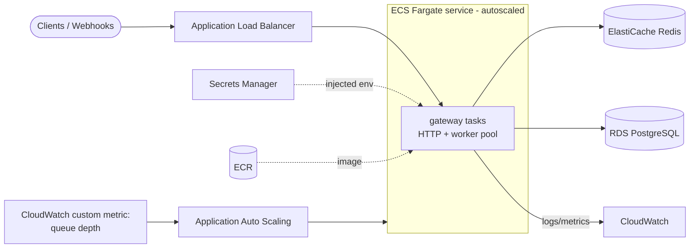
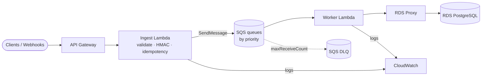

# AWS Deployment Guide

Two deployment topologies are described:

1. **Container topology (recommended):** the gateway runs as-is on **ECS Fargate** behind an **ALB**, with **ElastiCache (Redis)** and **RDS (PostgreSQL)**.
2. **Serverless topology (optional):** the ingestion edge is **API Gateway → Lambda**, work is queued in **SQS** (with a **DLQ**), and a worker Lambda processes it against **RDS via RDS Proxy**.

---

## 1. Container topology — ECS Fargate



### Components

| AWS service | Role |
|---|---|
| **ECR** | Stores the gateway container image (`make docker-build` → `docker push`). |
| **ECS Fargate** | Runs the gateway task; the HTTP server and worker pool live in the same task, scaled horizontally. |
| **Application Load Balancer** | TLS termination, health checks against `/ready`, routes to gateway tasks. Enable cross-zone + idle timeout > request timeout. |
| **ElastiCache (Redis)** | The job queue, idempotency keys, dedup and counters. Use cluster mode or a primary+replica with automatic failover; enable AUTH + in-transit encryption. |
| **RDS (PostgreSQL)** | Durable store for jobs, attempts and event tables. Multi-AZ for HA; run migrations as a one-off task. |
| **Secrets Manager** | `JWT_SECRET`, `PAYMENT_HMAC_SECRET`, `DATABASE_URL`, Redis AUTH — injected as task-definition `secrets`. |
| **CloudWatch Logs** | The gateway logs JSON to stdout; the `awslogs` driver ships it. Build log-metric filters/alarms on errors and dead-letter counts. |

### Step-by-step

1. **Build & push the image**
   ```bash
   aws ecr create-repository --repository-name ingress-api-gateway
   aws ecr get-login-password | docker login --username AWS --password-stdin <acct>.dkr.ecr.<region>.amazonaws.com
   make docker-build VERSION=1.0.0
   docker tag ingress-api-gateway:1.0.0 <acct>.dkr.ecr.<region>.amazonaws.com/ingress-api-gateway:1.0.0
   docker push <acct>.dkr.ecr.<region>.amazonaws.com/ingress-api-gateway:1.0.0
   ```
2. **Provision** ElastiCache (Redis) and RDS (PostgreSQL) in private subnets; put the gateway task in the same VPC. Lock security groups so only the gateway SG can reach Redis:6379 and Postgres:5432.
3. **Store secrets** in Secrets Manager and reference them from the task definition's `secrets` block (so they never appear in plaintext env or logs).
4. **Run migrations** once as a standalone Fargate task (or a CI step) against RDS: `psql "$DATABASE_URL" -f migrations/0001_init.up.sql`.
5. **Create the ECS service** with the task definition below behind the ALB target group; health check path `/ready`.
6. **Configure autoscaling** (next section).

### Task definition (essentials)

```jsonc
{
  "family": "ingress-api-gateway",
  "networkMode": "awsvpc",
  "requiresCompatibilities": ["FARGATE"],
  "cpu": "1024", "memory": "2048",
  "containerDefinitions": [{
    "name": "gateway",
    "image": "<acct>.dkr.ecr.<region>.amazonaws.com/ingress-api-gateway:1.0.0",
    "portMappings": [{ "containerPort": 8080 }],
    "environment": [
      { "name": "ENV", "value": "prod" },
      { "name": "REDIS_ADDR", "value": "my-redis.xxxx.ng.0001.use1.cache.amazonaws.com:6379" },
      { "name": "WORKER_COUNT", "value": "16" },
      { "name": "QUEUE_MAX_DEPTH", "value": "20000" }
    ],
    "secrets": [
      { "name": "DATABASE_URL",        "valueFrom": "arn:aws:secretsmanager:...:DATABASE_URL" },
      { "name": "JWT_SECRET",          "valueFrom": "arn:aws:secretsmanager:...:JWT_SECRET" },
      { "name": "PAYMENT_HMAC_SECRET", "valueFrom": "arn:aws:secretsmanager:...:PAYMENT_HMAC_SECRET" }
    ],
    "logConfiguration": {
      "logDriver": "awslogs",
      "options": {
        "awslogs-group": "/ecs/ingress-api-gateway",
        "awslogs-region": "<region>",
        "awslogs-stream-prefix": "gateway"
      }
    }
  }]
}
```

> Production guard: with `ENV=prod`, the app refuses to boot on default `JWT_SECRET`/`PAYMENT_HMAC_SECRET`, forcing real secrets.

### Autoscaling on CPU **and** queue depth

Two complementary signals:

- **CPU-based (target tracking):** keep average service CPU near ~60%.
- **Queue-depth-based:** the request rate may be cheap (just enqueues) while the *backlog* grows. Publish total queue depth to a CloudWatch custom metric and scale on backlog-per-task.

```bash
# Target tracking on CPU
aws application-autoscaling put-scaling-policy \
  --policy-type TargetTrackingScaling --service-namespace ecs \
  --resource-id service/<cluster>/ingress-api-gateway \
  --scalable-dimension ecs:service:DesiredCount \
  --policy-name cpu-60 \
  --target-tracking-scaling-policy-configuration \
  '{"TargetValue":60,"PredefinedMetricSpecification":{"PredefinedMetricType":"ECSServiceAverageCPUUtilization"}}'
```

For queue depth, run a small scheduled task / Lambda that reads `LLEN jobs:high + jobs:medium + jobs:low` and calls `PutMetricData` (namespace `IngressGateway`, metric `QueueDepth`), then attach a step- or target-tracking policy that scales out when `QueueDepth / RunningTaskCount` exceeds a threshold and scales in when the backlog clears. (The gateway already exposes `gateway_queue_depth` on `/metrics` if you prefer scraping via an ADOT/CloudWatch agent sidecar.)

---

## 2. Serverless topology (optional) — API Gateway + Lambda + SQS

When you'd rather not run always-on tasks, split ingestion from processing:



- **API Gateway** fronts the public endpoints (use request validators + WAF + usage plans / throttling for rate limiting at the edge).
- **Ingest Lambda** does the same cheap edge work the gateway does (validation, HMAC verification, idempotency via DynamoDB or ElastiCache), then `SendMessage` to **SQS**. Returns `202`.
- **SQS** replaces the Redis lists. Use separate queues (or message-group priority) and set **`RedrivePolicy` with `maxReceiveCount`** so poison messages land in a **dedicated DLQ** — the managed equivalent of this project's `jobs:dead-letter`. SQS gives at-least-once delivery + visibility timeouts; keep handlers idempotent (this project already is).
- **Worker Lambda** is triggered by SQS (event source mapping with batching + partial batch responses). It connects to Postgres through **RDS Proxy** to avoid exhausting connections under high Lambda concurrency.
- **CloudWatch** alarms on DLQ depth (`ApproximateNumberOfMessagesVisible`) and Lambda errors/throttles; SQS + Lambda autoscale natively with load.

### Container vs serverless trade-offs

| | ECS Fargate (container) | Lambda + SQS (serverless) |
|---|---|---|
| Priority queues | Native (Redis lists, `BRPOP`) | Multiple SQS queues / message grouping |
| Retries + DLQ | In-app backoff + `jobs:dead-letter` | SQS redrive + SQS DLQ |
| Idle cost | Pay for running tasks | Pay per request/invocation |
| Long/steady throughput | Most cost-effective | Can get pricey at very high sustained volume |
| Cold starts | None | Possible on worker spikes |
| Connection mgmt | Pooled (pgx) | RDS Proxy required |

The application code is deliberately portable: because queueing sits behind the `domain.Queue` port, the same processors can run under either topology.
